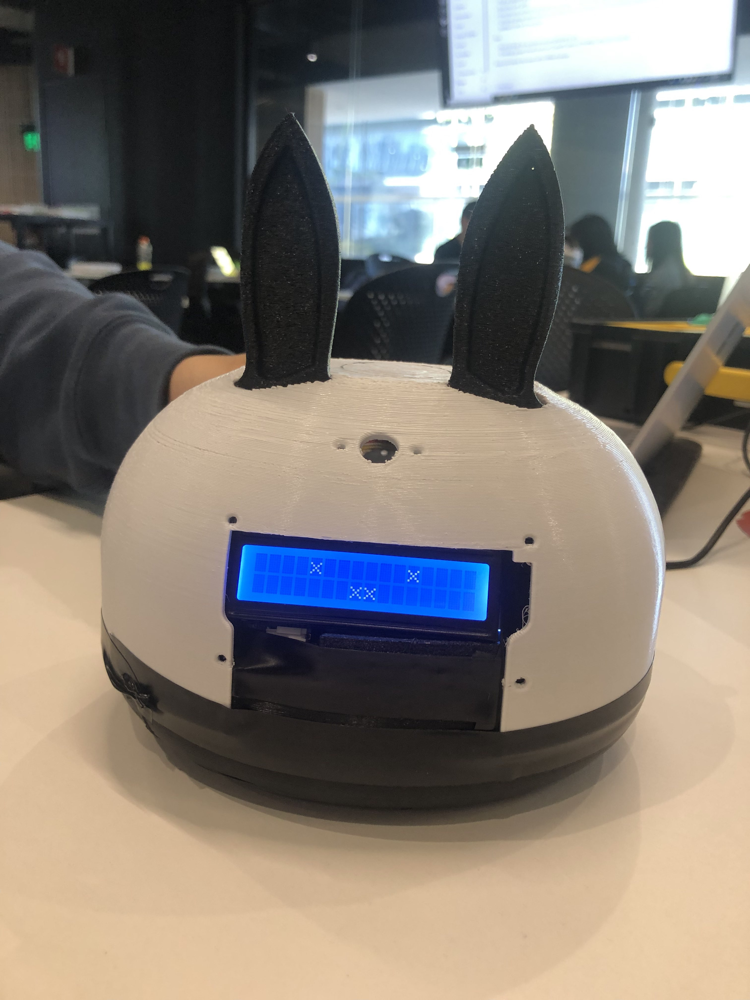

# Pomodoro_Study_Robot
Arduino study robot to facilitate learning
# Features
- Robot Expression Change depending on light level
- Study Timer (Pomodoro) with beeping alert
- Reaction Time Game (Entertainment)

